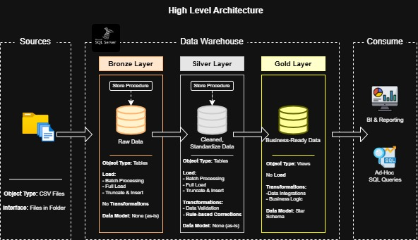

# Data Warehouse Project

Welcome to the **Data Warehouse Project** repository! 🚀  
This project showcases the development of a modern data warehouse using the Medallion Architecture (Bronze → Silver → Gold). It covers data ingestion, transformation, and modeling — designed to create clean, reliable, and scalable datasets for downstream analytics and reporting (which are outside the scope of this project).

This project is inspired by Data With Bara, and you can find his original YouTube tutorial and GitHub repository in the Reference section below.

---
## 🏗️ Data Architecture

The data architecture for this project follows Medallion Architecture **Bronze**, **Silver**, and **Gold** layers:


1. **Bronze Layer**: Stores raw data as-is from the source systems. Data is ingested from CSV Files into SQL Server Database.
2. **Silver Layer**: This layer includes data cleansing, standardization, and normalization processes to prepare data for analysis. 
3. **Gold Layer**: Houses business-ready data modeled into a star schema required for reporting and analytics.

---
## 📖 Project Overview

This project involves:

1. **Data Architecture**: Designing a Modern Data Warehouse Using Medallion Architecture **Bronze**, **Silver**, and **Gold** layers.
2. **ETL Pipelines**: Extracting, transforming, and loading data from source systems into the warehouse.
3. **Data Modeling**: Developing fact and dimension tables optimized for analytical queries.

---
## 🧾 Tools & Datasets
- **🧪 Dataset:**  
  Simulated e-commerce data generated using ChatGPT.  
  Contains 7 CSV files including orders, products, customers, payments, and more.

- **🗄️ Data Warehouse Platform:**  
  Built on **SQL Server**, developed and managed through **SQL Server Management Studio (SSMS)**.

---

## 📂 Repository Structure
```
data-warehouse-project/
│
├── datasets/                           
│
├── docs/                             
│   ├── data_architecture.drawio       
|
├── scripts/                          
│   ├── bronze/                        
│   ├── silver/                         
│   ├── gold/                           
│
├── tests/                            
│
├── README.md                          
├── LICENSE                             
```
---

## 📚 Reference

- 🎥 [SQL Data Warehouse from Scratch | Full Hands-On Data Engineering Project (YouTube)]([https://www.youtube.com/watch?v=YOUR_LINK](https://www.youtube.com/watch?v=9GVqKuTVANE&t=3345s))
- 💻 [SQL Data Warehouse Project Repository (GitHub)]([https://github.com/YOUR_REPO](https://github.com/DataWithBaraa/sql-data-warehouse-project/tree/main))
